# Data Flows — Megabrain v3.1

This document visualizes the end-to-end data flows for all major operations in Megabrain.

## Table of Contents

1. [Zotero Sync Flow](#zotero-sync-flow)
2. [Literature Search Flow](#literature-search-flow)
3. [Add Content Flows](#add-content-flows)
4. [Universal Search Flow](#universal-search-flow)
5. [Citation Backfill Flow](#citation-backfill-flow)
6. [Error Handling Flows](#error-handling-flows)

---

## Zotero Sync Flow

### High-Level Overview

```mermaid
graph TD
    A[User/Cron: zotero_sync] --> B[Load state.json]
    B --> C{Has last_synced?}
    C -->|Yes| D[Incremental Sync]
    C -->|No| E[Full Sync]
    D --> F[GET /items?since=version]
    E --> F
    F --> G[Zotero API Response]
    G --> H[Process Items Batch]
    H --> I{Has Attachments?}
    I -->|Yes| J[Download PDFs]
    I -->|No| K[Extract Metadata]
    J --> L[Extract PDF Text]
    L --> K
    K --> M{Has Notes?}
    M -->|Yes| N[Extract Note Text]
    M -->|No| O[Chunk Content]
    N --> O
    O --> P[Generate Embeddings]
    P --> Q{Content Type?}
    Q -->|Paper/PDF| R[Add to 📚 Literature]
    Q -->|Standalone Note| S[Add to 🧩 Mind]
    R --> T[Update state.json]
    S --> T
    T --> U[Return Sync Stats]
```



### Detailed Sync Process


### State Management


---

## Literature Search Flow

### End-to-End RAG Pipeline


### Detailed Search Sequence


### Citation Boost Calculation

```mermaid
graph LR
    A[Rerank Score: 0.85] --> B{Citation Count}
    B -->|0| C[Boost: 1.0]
    B -->|10| D[Boost: 1.36]
    B -->|100| E[Boost: 1.69]
    B -->|1000| F[Boost: 2.04]
    
    C --> G[Final: 0.85 × 1.0 = 0.85]
    D --> H[Final: 0.85 × 1.36 = 1.16]
    E --> I[Final: 0.85 × 1.69 = 1.44]
    F --> J[Final: 0.85 × 2.04 = 1.73]
    
    style G fill:#ffcccc
    style H fill:#ffeecc
    style I fill:#ffffcc
    style J fill:#ccffcc
```



**Formula**: `final_score = rerank_score × (1 + 0.15 × log(1 + citations))`

---

## Add Content Flows

### Add Note Flow (🧩)

```mermaid
graph TD
    A[User: add_note] --> B[UserContent.add_note]
    B --> C[Build Metadata]
    C --> D[TagInference.infer_tags]
    D --> E[LLM Prompt: Extract Topics]
    E --> F[Parse LLM Response]
    F --> G[Merge with User Metadata]
    G --> H[Chunk Text]
    H --> I[Generate Embeddings]
    I --> J[Add to 🧩 Mind Index]
    J --> K[Save Index]
    K --> L[Return ID + Stats]
```



### Add URL Flow (🧩)


### Add Video Transcript Flow (🧩)

```mermaid
graph TD
    A[User: add_video_transcript] --> B[Extract Video ID]
    B --> C[YouTube API / yt-dlp]
    C --> D{Transcript Available?}
    D -->|Yes| E[Download Transcript]
    D -->|No| F[Error: No Captions]
    E --> G[Combine Segments]
    G --> H[Get Video Metadata]
    H --> I[TagInference]
    I --> J[Chunk + Embed]
    J --> K[Add to 🧩 Mind]
    K --> L[Return Stats]
    F --> M[Return Error]
```



### Add Audio Content Flow (🧩)

```mermaid
graph TD
    A[User: add_audio_content] --> B[Download Audio File]
    B --> C[Whisper Transcription]
    C --> D[Full Transcript Text]
    D --> E[TagInference]
    E --> F[Chunk + Embed]
    F --> G[Add to 🧩 Mind]
    G --> H[Return Stats]
```



### Add to Second Brain Flow (🧠)

```mermaid
graph TD
    A[User: add_to_brain] --> B[Validate Category/Tags]
    B --> C[TagInference Enhancement]
    C --> D[Merge Manual + Auto Tags]
    D --> E[Chunk Content]
    E --> F[Generate Embeddings]
    F --> G[Add to 🧠 Second Brain]
    G --> H[Save Index]
    H --> I[Return ID + Stats]
```



---

## Universal Search Flow

### Cross-Partition Search

```mermaid
graph TD
    A[User: universal_search] --> B[Embed Query]
    B --> C[Parallel Search]
    C --> D[Search 📚 Literature k=10]
    C --> E[Search 🧩 Mind k=10]
    C --> F[Search 🧠 Second Brain k=10]
    D --> G[Merge Results Pool: 30]
    E --> G
    F --> G
    G --> H[Voyage Rerank-2]
    H --> I[Top-15 Cross-Partition]
    I --> J[Group by Partition]
    J --> K[Format with Emojis]
    K --> L[Return Structured Results]
```



### Detailed Universal Search Sequence

```mermaid
sequenceDiagram
    participant U as User
    participant SB as SecondBrain
    participant VE as Voyage API
    participant LI as Lit Index
    participant MI as Mind Index
    participant BI as Brain Index

    U->>SB: universal_search(query)
    
    SB->>VE: Embed query
    VE-->>SB: query_vec
    
    par Search all partitions
        SB->>LI: search(query_vec, k=10)
        LI-->>SB: [10 lit results]
    and
        SB->>MI: search(query_vec, k=10)
        MI-->>SB: [10 mind results]
    and
        SB->>BI: search(query_vec, k=10)
        BI-->>SB: [10 brain results]
    end
    
    SB->>SB: Merge into pool [30 results]
    
    SB->>VE: Rerank(query, [30 docs], top_k=15)
    VE-->>SB: [15 reranked results]
    
    SB->>SB: Group by partition:<br/>📚 Literature: 5<br/>🧩 Mind: 6<br/>🧠 Second Brain: 4
    
    SB->>SB: Format with partition labels
    
    SB-->>U: Structured results
```



---

## Citation Backfill Flow

### Update Citation Counts


### Citation API Integration


---

## Error Handling Flows

### Sync Error Recovery


### Search Error Handling


### Add Content Error Handling


---

## Data Structure Transformations

### Paper → FAISS Entry


**Example Transformation**:
```
Input (Zotero):
{
  "key": "ABC123",
  "title": "Attention Is All You Need",
  "creators": [{"firstName": "Ashish", "lastName": "Vaswani"}],
  "date": "2017"
}

↓ Process

Output (FAISS Metadata):
[
  {
    "item_key": "ABC123",
    "title": "Attention Is All You Need",
    "authors": ["Vaswani, Ashish"],
    "year": 2017,
    "chunk_index": 0,
    "text": "The dominant sequence transduction models..."
  },
  {
    "item_key": "ABC123",
    "title": "Attention Is All You Need",
    "authors": ["Vaswani, Ashish"],
    "year": 2017,
    "chunk_index": 1,
    "text": "...based on complex recurrent or convolutional..."
  }
]
```

---

## Performance Flows

### Latency Breakdown (Search)


**Total Latency**: ~765ms per search

---

## Cron Job Flow

### Auto-Sync Schedule

```mermaid
gantt
    title Megabrain Auto-Sync (Daily Schedule)
    dateFormat HH:mm
    axisFormat %H:%M

    section Sync Events
    Sync Run 1: 00:00, 00:02
    Sync Run 2: 02:00, 02:02
    Sync Run 3: 04:00, 04:02
    Sync Run 4: 06:00, 06:02
    Sync Run 5: 08:00, 08:02
    Sync Run 6: 10:00, 10:02
    Sync Run 7: 12:00, 12:02
    Sync Run 8: 14:00, 14:02
    Sync Run 9: 16:00, 16:02
    Sync Run 10: 18:00, 18:02
    Sync Run 11: 20:00, 20:02
    Sync Run 12: 22:00, 22:02
```

### Cron Job Execution

```mermaid
sequenceDiagram
    participant CR as Cron Daemon
    participant SH as Shell Script
    participant ZS as ZoteroSync
    participant LOG as Log File

    CR->>SH: Execute zotero-sync-v2.sh
    SH->>LOG: Timestamp: Start
    SH->>ZS: python -m megabrain.zotero_tools sync
    
    alt Sync Successful
        ZS-->>SH: Exit 0 + Stats
        SH->>LOG: Success + Stats
        SH-->>CR: Exit 0
    else Sync Failed
        ZS-->>SH: Exit 1 + Error
        SH->>LOG: Error + Traceback
        SH-->>CR: Exit 1
    end
```

---

## Summary

### Key Data Flow Patterns

1. **Incremental Sync**: State-based versioning minimizes API calls
2. **Multi-Stage Retrieval**: FAISS → Rerank → Boost for precision
3. **Parallel Search**: Universal search queries all partitions concurrently
4. **Error Recovery**: Graceful degradation (skip rerank/LLM if needed)
5. **Async Processing**: Background cron job keeps data fresh

### Bottlenecks

| Operation | Bottleneck | Mitigation |
|-----------|------------|------------|
| Sync | Zotero API rate limits | Batch requests, incremental sync |
| Search | Voyage rerank API latency | Cache frequent queries (future) |
| Embedding | Voyage API cost | Efficient chunking, batch operations |
| LLM Synthesis | Venice.ai latency | Stream responses (future) |

---

**Version**: 3.1  
**Last Updated**: February 2026
