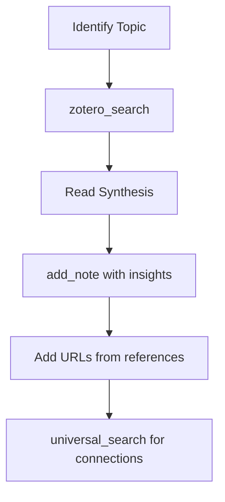
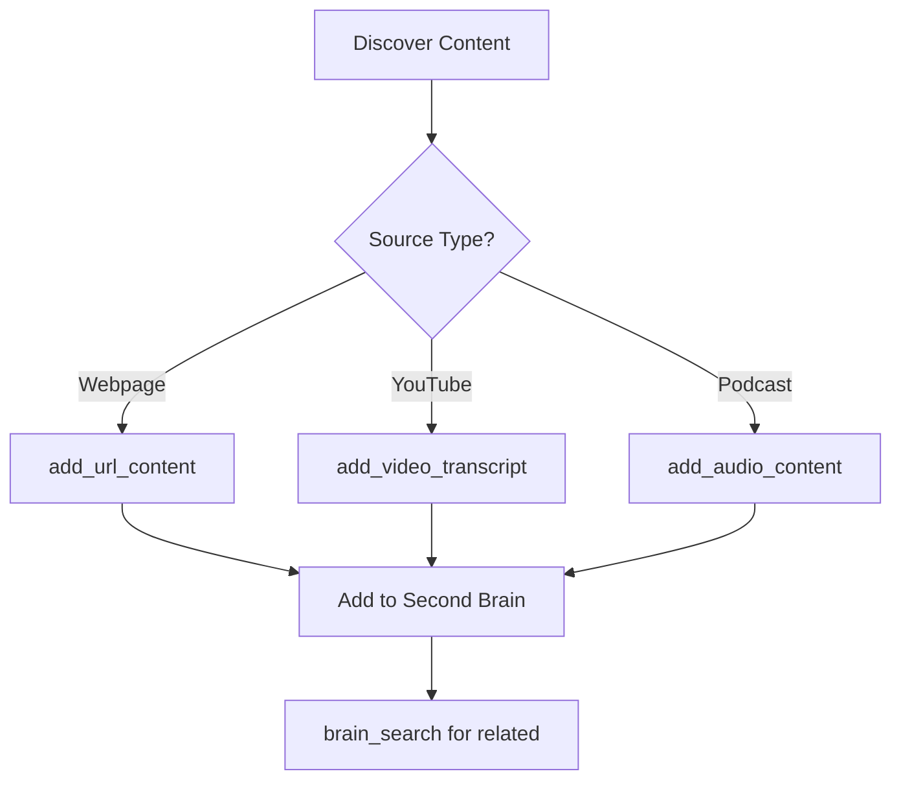
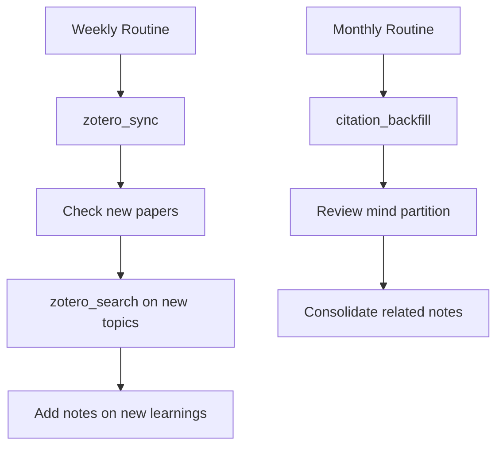

# Functional Design — Megabrain v3.1

This document describes the user-facing behaviors, use cases, and workflows of the Megabrain system.

## Table of Contents

1. [Use Cases](#use-cases)
2. [Tool Behaviors](#tool-behaviors)
3. [Search Patterns](#search-patterns)
4. [Response Formatting](#response-formatting)
5. [Workflow Examples](#workflow-examples)
6. [Best Practices](#best-practices)

---

## Use Cases

### 1. Literature Research (📚)

**Scenario**: You're exploring a research topic and need to understand the current state of knowledge.

**Tools**:
- `zotero_search(query)` — Semantic search across your Zotero library
- `zotero_sync()` — Keep library up-to-date

**Example**:
```
Query: "What are the current approaches to explainable AI in healthcare?"

Output:
[Thematic synthesis of 15 papers]
1. Key themes: trust, interpretability, clinical deployment
2. Cross-paper insights: Trade-off between accuracy and explainability
3. Individual summaries with citations
4. Full bibliography
```

---

### 2. Personal Knowledge Management (🧩)

**Scenario**: You want to capture insights, notes, and content for future reference.

**Tools**:
- `add_note(note, title)` — Quick note capture
- `add_url_content(url, title)` — Save webpage content
- `add_video_transcript(url, title)` — YouTube videos
- `add_audio_content(url, title)` — Podcasts/audio

**Example**:
```
add_note("The key to transformer efficiency is sparse attention—only 
attend to relevant tokens instead of all tokens. This reduces O(n²) to 
O(n log n) complexity.", "Sparse Attention Insight")

→ Added to 🧩 mind with automatic topic tagging:
   topics: ["transformers", "attention mechanisms"]
   subtopics: ["sparse attention", "computational efficiency"]
```

---

### 3. General Knowledge Collection (🧠)

**Scenario**: You're curating articles, ideas, and resources on various topics.

**Tools**:
- `add_to_brain(content, source_type, url, category, tags, title)` — Add categorized content
- `brain_search(query, category)` — Search within categories

**Example**:
```
add_to_brain(
    content="Introduction to quantum computing basics...",
    source_type="article",
    url="https://example.com/quantum-intro",
    category="quantum_computing",
    tags=["qubits", "superposition"],
    title="Quantum Computing 101"
)

→ Stored in 🧠 second_brain with category filter
```

---

### 4. Cross-Partition Discovery (📚🧩🧠)

**Scenario**: You need to find information but don't know which partition it's in.

**Tools**:
- `universal_search(query)` — Search all three partitions simultaneously

**Example**:
```
universal_search("neural network optimization techniques")

→ Returns ranked results from:
   📚 Literature: 5 academic papers on optimization
   🧩 Mind: 2 personal notes on gradient descent tricks
   🧠 Second Brain: 3 blog posts on practical training tips
```

---

## Tool Behaviors

### Literature Tools (📚)

#### zotero_search(query)

**Purpose**: Semantic search across academic papers with RAG synthesis.

**Parameters**:
- `query` (str): Natural language search query

**Behavior**:
1. Embeds query with Voyage-2
2. Retrieves top-100 candidates from FAISS
3. Reranks with Voyage rerank-2 → top-15
4. Applies citation boost
5. Synthesizes with Grok-41-fast
6. Returns thematic analysis + bibliography

**Output Structure**:
```
## Thematic Analysis
[2-3 major themes identified across papers]

## Cross-Paper Synthesis
[Connections, contrasts, and patterns]

## Key Findings
[Bullet-point summary of main insights]

## Appendix: Individual Papers
[Detailed summaries for each paper]

## Bibliography
[Full citation list]
```

**Response Format Rules**:
- **Enumeration requests** ("list papers on X"): Return title, authors, year, one-line summary
- **Concept requests** ("explain X"): Return full synthesis with citations
- **Large results**: Split across messages, offer "continue"

---

#### zotero_sync()

**Purpose**: Incremental sync with Zotero library.

**Parameters**: None

**Behavior**:
1. Reads `last_synced` version from `state.json`
2. Fetches changed items since last sync
3. Downloads PDFs (if configured)
4. Extracts text and notes
5. Chunks and embeds content
6. Adds papers to 📚 literature
7. Adds standalone notes to 🧩 mind
8. Updates `state.json`

**Output**:
```json
{
  "status": "success",
  "papers_added": 5,
  "papers_updated": 3,
  "notes_added": 12,
  "chunks_indexed": 847,
  "duration_seconds": 45.2
}
```

**Auto-Sync**:
- Cron job runs every 2 hours
- Script: `/home/san/.openclaw/workspace/zotero-sync-v2.sh`
- No user interaction required

---

#### zotero_sync_notes()

**Purpose**: Backfill ALL notes from Zotero (not just changed items).

**Parameters**: None

**Behavior**:
- Fetches every note in the library
- Extracts text content
- Adds to 🧩 mind partition
- Useful for initial setup or after metadata changes

**Use Case**: Run once after initial Megabrain setup.

---

#### citation_backfill()

**Purpose**: Update citation counts for all papers in literature index.

**Parameters**: None

**Behavior**:
1. Reads all papers from 📚 literature
2. Queries citation counts (via Semantic Scholar API or Zotero)
3. Updates metadata in FAISS index
4. Persists changes

**Use Case**: Run monthly to keep citation boosts accurate.

---

### Mind Tools (🧩)

#### add_memory(content, metadata)

**Purpose**: Add structured content to mind partition.

**Parameters**:
- `content` (str): The actual text/content
- `metadata` (dict): Structured metadata (see schema below)

**Metadata Schema**:
```python
{
    "title": str,                      # Required
    "content_type": str,               # note|url|video|audio|zotero_note
    "source_url": str | None,          # Optional
    "topics": list[str],               # Auto-generated if not provided
    "subtopics": list[str],            # Auto-generated if not provided
    "context": str | None,             # Optional context
    "sentiment": str | None,           # Optional sentiment
    "supersedes": list[str] | None,    # IDs of older content this replaces
    "action_items": list[str] | None,  # Optional action items
    "related_to": list[str] | None     # Related concepts
}
```

**Behavior**:
1. Validates metadata
2. Enriches missing fields via LLM (topics, subtopics)
3. Chunks content
4. Generates embeddings
5. Adds to 🧩 mind
6. Returns content ID

**Output**:
```json
{
  "status": "success",
  "id": "mind_20240115_103045_abc",
  "chunks_added": 3,
  "topics": ["transformers", "efficiency"],
  "subtopics": ["sparse attention", "model compression"]
}
```

---

#### add_note(note, title)

**Purpose**: Quick note capture (simplified version of `add_memory`).

**Parameters**:
- `note` (str): Note content
- `title` (str): Note title

**Behavior**:
- Wraps `add_memory` with minimal metadata
- Auto-generates topics and subtopics
- Stores as `content_type: "note"`

**Example**:
```python
add_note(
    "Sparse attention reduces complexity from O(n²) to O(n log n)",
    "Sparse Attention Efficiency"
)
```

---

#### add_url_content(url, title)

**Purpose**: Extract and store webpage content.

**Parameters**:
- `url` (str): Webpage URL
- `title` (str, optional): Custom title (auto-generated if None)

**Behavior**:
1. Fetches webpage content
2. Extracts main text (removes ads, menus, etc.)
3. Generates title from `<title>` tag if not provided
4. Enriches metadata via LLM
5. Adds to 🧩 mind

**Supported Sites**: Any HTML page (uses BeautifulSoup + Readability)

---

#### add_video_transcript(url, title)

**Purpose**: Download YouTube transcript and store in mind.

**Parameters**:
- `url` (str): YouTube video URL
- `title` (str, optional): Custom title (uses video title if None)

**Behavior**:
1. Extracts video ID from URL
2. Downloads transcript via YouTube API (or yt-dlp)
3. Combines transcript segments into full text
4. Enriches metadata
5. Adds to 🧩 mind

**Limitations**: Requires video to have captions/transcripts available.

---

#### add_audio_content(url, title)

**Purpose**: Transcribe audio content (podcasts, recordings) and store in mind.

**Parameters**:
- `url` (str): Direct audio file URL or streaming link
- `title` (str, optional): Custom title

**Behavior**:
1. Downloads audio file
2. Transcribes with Whisper (or external transcription API)
3. Enriches metadata
4. Adds to 🧩 mind

**Supported Formats**: MP3, WAV, M4A, etc.

---

### Second Brain Tools (🧠)

#### brain_search(query, category)

**Purpose**: Search within second_brain partition, optionally filtered by category.

**Parameters**:
- `query` (str): Search query
- `category` (str, optional): Filter by category (e.g., "quantum_computing")

**Behavior**:
1. Embeds query
2. Searches 🧠 second_brain FAISS index
3. Filters by category if specified
4. Returns top-10 results

**Output Format**:
```
Found 8 results in category "quantum_computing":

1. **Quantum Computing 101** (article)
   Tags: qubits, superposition
   Snippet: "Introduction to quantum computing basics..."
   
2. **Shor's Algorithm Explained** (video)
   Tags: quantum algorithms, factoring
   Snippet: "Shor's algorithm demonstrates quantum advantage..."
```

---

#### add_to_brain(content, source_type, url, category, tags, title)

**Purpose**: Add categorized content to second brain.

**Parameters**:
- `content` (str): Full text content
- `source_type` (str): article|video|note|audio
- `url` (str, optional): Source URL
- `category` (str): Category name (e.g., "machine_learning")
- `tags` (list[str]): Manual tags
- `title` (str): Content title

**Behavior**:
1. Validates category and tags
2. Enriches with additional metadata via LLM
3. Chunks content
4. Generates embeddings
5. Adds to 🧠 second_brain

**Category Convention**: Use lowercase with underscores (e.g., `quantum_computing`, `web_development`)

---

### Universal Tools

#### universal_search(query)

**Purpose**: Search across all three partitions simultaneously.

**Parameters**:
- `query` (str): Search query

**Behavior**:
1. Embeds query with Voyage-2
2. Searches all three FAISS indices
3. Retrieves top-10 from each partition
4. Merges results (30 total)
5. Reranks with Voyage rerank-2
6. Returns top-15 with partition labels

**Output Format**:
```
Universal Search Results for "transformer optimization":

📚 LITERATURE (5 results)
1. [Paper] "Efficient Transformers: A Survey" (2021)
   Authors: Tay et al.
   Snippet: "We categorize efficient transformer variants..."

2. [Paper] "Sparse Attention with Linear Complexity" (2020)
   ...

🧩 MIND (4 results)
1. [Note] "Sparse Attention Insight" (2024-01-15)
   Snippet: "The key to transformer efficiency is sparse attention..."

2. [URL] "Optimizing BERT for Production"
   ...

🧠 SECOND_BRAIN (3 results)
1. [Article] "Practical Tips for Training Large Models"
   Category: machine_learning
   ...
```

---

## Search Patterns

### When to Use Each Search

| Scenario | Tool | Reason |
|----------|------|--------|
| "Find papers about X" | `zotero_search` | Need academic synthesis |
| "What did I read about X?" | `universal_search` | Could be literature or mind |
| "Show me my notes on X" | `universal_search` with mind filter | Targeting mind only |
| "Quantum computing resources" | `brain_search("quantum computing", "quantum_computing")` | Category-specific |
| "Everything related to X" | `universal_search` | Comprehensive discovery |

### Query Formulation Tips

**Good Queries**:
- "Attention mechanisms in transformer models"
- "Challenges in deploying ML models to production"
- "Quantum entanglement and superposition"

**Poor Queries**:
- "AI" (too broad)
- "Paper by Smith" (use author search in Zotero UI instead)
- Single keywords without context

**Optimal Length**: 5-15 words (balances specificity and recall)

---

## Response Formatting

### Enumeration Requests

**Trigger Patterns**: "list papers", "show me articles", "enumerate"

**Format**:
```
Found 12 papers on "reinforcement learning":

1. **Deep Q-Networks** (Mnih et al., 2015)
   One-line: DQN combines Q-learning with deep neural networks for game playing.

2. **Proximal Policy Optimization** (Schulman et al., 2017)
   One-line: PPO stabilizes policy gradient methods with clipped objectives.
   
...
```

---

### Concept Requests

**Trigger Patterns**: "explain X", "what is X", "summarize X"

**Format**:
```
## Overview
[High-level explanation]

## Key Concepts
[Detailed breakdown with citations]

## Current Research
[State of the field, citing papers]

## Related Topics
[Connections to other areas]

## Bibliography
[Full citations]
```

---

### Large Results

**Behavior**: If synthesis exceeds ~2000 words, split into multiple messages.

**Format**:
```
[Message 1]
## Thematic Analysis
...
[continues with first 2 themes]

(1/3 - Reply "continue" for more)

[Message 2]
## Cross-Paper Synthesis
...

(2/3 - Reply "continue" for bibliography)

[Message 3]
## Bibliography
...

(3/3 - Complete)
```

---

### Mind Partition Results

**Special Behavior**: When searching 🧩 mind, prioritize:
1. **Topic Discovery**: Group results by themes
2. **Temporal Context**: Show dates to track evolution of thought
3. **Knowledge Synthesis**: Connect related notes

**Format**:
```
🧩 Mind Search: "transformer efficiency"

## Topics Discovered
- Sparse Attention (3 notes)
- Model Compression (2 notes)
- Training Optimization (4 notes)

## Key Insights (Chronological)
2023-12-01: Initial exploration of pruning techniques
2024-01-15: Breakthrough understanding of sparse attention
2024-02-10: Combining pruning + sparse attention

## Detailed Notes
[Full content of relevant notes]
```

---

## Workflow Examples

### Workflow 1: Research Deep Dive



**Example Commands**:
```python
# Step 1: Initial research
zotero_search("adversarial robustness in vision models")

# Step 2: Capture key insight
add_note("Adversarial training trades off clean accuracy for 
robust accuracy—there's a fundamental tension here.", 
"Adversarial Training Trade-off")

# Step 3: Save important reference
add_url_content("https://adversarial-ml-tutorial.org", 
"Adversarial ML Tutorial")

# Step 4: Find related personal notes
universal_search("robustness and accuracy trade-offs")
```

---

### Workflow 2: Content Curation



**Example Commands**:
```python
# Curate quantum computing resources
add_to_brain(
    content=extracted_text,
    source_type="article",
    url="https://quantum-journal.org/intro",
    category="quantum_computing",
    tags=["basics", "qubits"],
    title="Quantum Computing Fundamentals"
)

# Find related quantum content
brain_search("quantum algorithms", category="quantum_computing")
```

---

### Workflow 3: Periodic Maintenance



**Example Commands**:
```bash
# Weekly: Update literature
zotero_sync()

# Monthly: Update citations
citation_backfill()

# Quarterly: Review and consolidate
universal_search("all my notes on transformers")
# Then consolidate into comprehensive note
```

---

## Best Practices

### 1. Consistent Tagging

**Do**:
- Use lowercase tags: `machine_learning`, `quantum_computing`
- Be specific: `sparse_attention` > `attention`
- Include broader context: `["transformers", "nlp", "attention"]`

**Don't**:
- Mix case: ~~`Machine_Learning`~~
- Use spaces: ~~`machine learning`~~
- Overly generic: ~~`ai`, `tech`~~

---

### 2. Title Conventions

**Literature** (automatic from Zotero):
- Use original paper title

**Mind**:
- Descriptive: "Sparse Attention Efficiency Insight"
- Context: "Meeting Notes - ML Team 2024-01-15"
- Action: "TODO: Test Pruning Implementation"

**Second Brain**:
- Topical: "Introduction to Quantum Computing"
- Source-aware: "HN Discussion: Rust vs Go Performance"

---

### 3. Note Granularity

**Good Note Size**: 100-1000 words
- Too short (<50 words): Hard to search, lacks context
- Too long (>2000 words): Should be broken into subtopics

**Example**:
```
❌ Too Short:
"Sparse attention is faster"

✅ Right Size:
"Sparse attention reduces transformer complexity from O(n²) to O(n log n) 
by only attending to relevant tokens. Key implementations: Longformer 
(sliding window + global), BigBird (random + window + global), Linformer 
(low-rank projection). Trade-off: 2-3% accuracy loss for 10x speed gain."
```

---

### 4. Superseding Notes

When updating knowledge, use `supersedes` field:

```python
add_memory(
    content="Updated understanding: Sparse attention variants each have 
    different trade-offs. Longformer best for documents, BigBird for general 
    NLP, Linformer for speed-critical apps.",
    metadata={
        "title": "Sparse Attention Trade-offs (Updated)",
        "supersedes": ["mind_20231201_080000_xyz"]  # Old note ID
    }
)
```

This preserves history while marking old content as outdated.

---

### 5. Action Items

Capture TODOs in metadata:

```python
add_note(
    "Explored pruning literature. Key papers: LotteryTicket, Magnitude Pruning.",
    title="Pruning Literature Review",
    metadata={
        "action_items": [
            "Read LotteryTicket paper in detail",
            "Test magnitude pruning on BERT",
            "Compare with knowledge distillation"
        ]
    }
)
```

Retrieve with: `universal_search("action items pruning")`

---

### 6. Sync Timing

**Automatic**: Let cron job handle routine syncs (every 2 hours)

**Manual**: Run `zotero_sync()` when:
- Added many papers at once (>10)
- Before important research session
- After changing Zotero tags/metadata

**Initial Setup**: Run `zotero_sync_notes()` once to backfill all notes.

---

## Common Questions

### "How do I search just my notes?"

Use `universal_search` and look for 🧩 results, or filter in application code.

### "Can I delete content?"

Not directly via tools. Requires manual FAISS index editing (advanced).

### "How do I export content?"

Read the `.pkl` files:
```python
import pickle
with open("~/.openclaw/workspace/research-vector-db/mind/index.pkl", "rb") as f:
    data = pickle.load(f)
    texts = data["texts"]
    metadatas = data["metadatas"]
```

### "What if sync fails?"

Check `state.json` — if corrupted, manually set `last_synced` to 0 and re-sync.

---

**Version**: 3.1  
**Last Updated**: February 2026
