# Technical Design — Megabrain v3.1

This document details the architecture, data structures, and implementation of the Megabrain knowledge management system.

## Table of Contents

1. [System Architecture](#system-architecture)
2. [Storage Layer](#storage-layer)
3. [Component Design](#component-design)
4. [Data Structures](#data-structures)
5. [RAG Pipeline](#rag-pipeline)
6. [Configuration](#configuration)
7. [Performance Considerations](#performance-considerations)

---

## System Architecture

### High-Level Overview

```mermaid
graph TB
    subgraph "OpenClaw Tools"
        ZS[zotero_search]
        ZY[zotero_sync]
        AM[add_memory]
        AN[add_note]
        AU[add_url_content]
        AV[add_video_transcript]
        AA[add_audio_content]
        BS[brain_search]
        AB[add_to_brain]
        US[universal_search]
    end
    
    subgraph "Core Modules"
        ZT[zotero_tools.py]
        SB[second_brain.py]
        UC[user_content.py]
        TI[tag_inference.py]
    end
    
    subgraph "Vector Storage"
        LIT[📚 literature/]
        MND[🧩 mind/]
        BR[🧠 second_brain/]
    end
    
    subgraph "External Services"
        ZO[Zotero API]
        VO[Voyage AI]
        VE[Venice.ai LLM]
    end
    
    ZS --> ZT --> LIT
    ZY --> ZT --> LIT
    ZY --> ZT --> MND
    AM --> UC --> MND
    AN --> UC --> MND
    AU --> UC --> MND
    AV --> UC --> MND
    AA --> UC --> MND
    BS --> SB --> BR
    AB --> SB --> BR
    US --> ZT --> LIT
    US --> SB --> MND
    US --> SB --> BR
    
    ZT --> ZO
    ZT --> VO
    ZT --> VE
    SB --> VO
    SB --> VE
    UC --> VO
    UC --> TI --> VE
```



### Triple Partition Design

Each partition is a **completely independent FAISS index** with its own:
- `index.faiss` — FAISS index file (IndexFlatIP for inner product similarity)
- `index.pkl` — Pickled metadata (texts, metadatas, ids)
- Semantic purpose and retrieval patterns

**Why three partitions?**
- **Isolation**: Different content types don't pollute each other's semantic space
- **Optimization**: Each partition can have specialized metadata schemas
- **Control**: Fine-grained search targeting (literature-only, mind-only, or universal)

---

## Storage Layer

### Directory Structure

```
~/.openclaw/workspace/research-vector-db/
├── literature/
│   ├── index.faiss       # 386 papers, 54,985 chunks
│   └── index.pkl         # Metadata + texts
├── mind/
│   ├── index.faiss       # Personal notes + standalone Zotero notes
│   └── index.pkl
├── second_brain/
│   ├── index.faiss       # Web clippings, ideas
│   └── index.pkl
└── state.json            # Sync state tracking
```

### FAISS Implementation

**Index Type**: `IndexFlatIP` (Inner Product)
- No quantization — full precision
- Brute-force search for guaranteed accuracy
- Fast enough for current scale (<100k chunks per partition)

**Embedding Model**: Voyage-2
- Dimension: 1024
- Normalization: L2-normalized vectors
- Inner product = cosine similarity when normalized

### Metadata Schema

#### Literature Partition (📚)
```json
{
  "item_key": "ABC123XYZ",
  "title": "Attention Is All You Need",
  "authors": ["Vaswani, Ashish", "Shazeer, Noam"],
  "year": 2017,
  "item_type": "journalArticle",
  "abstract": "...",
  "doi": "10.1234/example",
  "url": "https://arxiv.org/abs/1706.03762",
  "citations": 15000,
  "topics": ["deep learning", "nlp", "transformers"],
  "subtopics": ["attention mechanisms", "sequence modeling"],
  "methodology": "design-science",
  "related_to": ["BERT", "GPT"],
  "chunk_index": 0,
  "source": "pdf_content",
  "date_added": "2024-01-15T10:30:00Z"
}
```

#### Mind Partition (🧩)
```json
{
  "id": "mind_20240115_103045_abc",
  "title": "Thoughts on transformer efficiency",
  "content_type": "note|url|video|audio|zotero_note",
  "source_url": "https://example.com/article",
  "date_added": "2024-01-15T10:30:45Z",
  "topics": ["transformers", "efficiency"],
  "subtopics": ["sparse attention", "model compression"],
  "context": "exploring optimization techniques",
  "sentiment": "optimistic",
  "supersedes": ["mind_20231201_080000_xyz"],
  "action_items": ["read pruning paper", "test sparse attention"],
  "related_to": ["GPT optimization", "BERT distillation"]
}
```

#### Second Brain Partition (🧠)
```json
{
  "id": "brain_20240115_103045_abc",
  "title": "Introduction to Quantum Computing",
  "content": "...",
  "source_type": "article|video|note|audio",
  "source_url": "https://example.com",
  "category": "quantum_computing",
  "tags": ["qubits", "superposition", "entanglement"],
  "topics": ["quantum computing", "physics"],
  "subtopics": ["quantum gates", "quantum algorithms"],
  "source_author": "John Doe",
  "date_added": "2024-01-15T10:30:45Z",
  "related_to": ["quantum mechanics", "linear algebra"]
}
```

---

## Component Design

### 1. zotero_tools.py (~1200 lines)

#### ZoteroSync Class

**Responsibilities**:
- Incremental sync with Zotero API
- PDF download and extraction
- Note parsing and indexing
- State management

**Key Methods**:
```python
class ZoteroSync:
    def __init__(self, user_id, library_type, api_key)
    def sync(self) -> dict
    def sync_notes(self) -> dict
    def _get_library_version(self) -> int
    def _fetch_changed_items(self, since_version) -> list
    def _process_item_batch(self, items) -> tuple
    def _download_pdf(self, item_key, attachment) -> str
    def _extract_pdf_text(self, pdf_path) -> str
    def _extract_notes(self, item) -> list
    def _chunk_text(self, text, metadata) -> list
    def _add_to_literature(self, chunks)
    def _add_to_mind(self, chunks)
```

**State Tracking** (from `state.json`):
```python
# ~/.openclaw/workspace/personal-skills/megabrain/state.json
{
    "last_synced": 13537,  # Zotero library version number
    "item_versions": {},   # Per-item version tracking (sync_v2)
    "sync_history": [
        {
            "timestamp": "2026-02-19T19:30:00+05:30",
            "note": "State initialized from existing FAISS index (54985 chunks, 386 papers)"
        }
    ]
}
```

**Incremental Sync Logic** (v2 — OOM-resistant):
1. Read `last_synced` version from `state.json`
2. Query Zotero API: `GET /items?since={last_synced}`
3. **Metadata fast path**: If only metadata changed (not content), patch FAISS without re-embedding
4. **Content hash dedup**: Skip if content hash unchanged
5. **Batched FAISS writes**: Save every 10 items to prevent memory spikes
6. Update `state.json` with new version

**Auto-Sync Cron**:
- **Job ID**: `2b7b3c5e-ea6e-4a18-8822-aab4d47c66b6`
- **Schedule**: Every 2 hours (IST)
- **Script**: `/home/san/.openclaw/workspace/zotero-sync-v2.sh`
- **Model**: grok-41-fast (isolated session)

**sync_v2.py Features** (deployed 2026-02-20):
- Per-item version/hash tracking in state.json
- Handles 397+ items without OOM
- Separate path for standalone notes → mind/

#### ZoteroSearch Class

**Responsibilities**:
- Semantic search across literature partition
- Hybrid RAG synthesis
- Citation boosting
- Bibliography generation

**Key Methods**:
```python
class ZoteroSearch:
    def __init__(self, faiss_index, llm_client, voyage_client)
    def search(self, query: str, top_k: int = 15) -> dict
    def _embed_query(self, query: str) -> np.ndarray
    def _faiss_search(self, query_vec, k: int = 100) -> list
    def _rerank(self, query: str, candidates: list, top_k: int) -> list
    def _citation_boost(self, scored_docs: list) -> list
    def _synthesize(self, query: str, docs: list) -> str
    def _generate_bibliography(self, docs: list) -> str
```

---

### 2. second_brain.py (~450 lines)

#### SecondBrain Class

**Responsibilities**:
- Manage second_brain partition
- Category-filtered search
- Universal search orchestration

**Key Methods**:
```python
class SecondBrain:
    def __init__(self, persist_dir: str)
    def add_content(self, content: str, metadata: dict) -> str
    def search(self, query: str, category: str = None, top_k: int = 10) -> list
    def universal_search(self, query: str, top_k_per_partition: int = 10) -> dict
    def _merge_and_rerank(self, results_by_partition: dict, query: str) -> list
```

**Universal Search Strategy**:
1. Query all three FAISS indices in parallel
2. Retrieve top-N from each partition
3. Merge results into unified pool
4. Rerank with Voyage rerank-2
5. Return top-K with partition labels

---

### 3. user_content.py (~550 lines)

#### Content Extraction & Metadata Pipeline

**Responsibilities**:
- URL content extraction (web scraping with BeautifulSoup)
- YouTube metadata + transcript (yt-dlp)
- Audio/podcast extraction (yt-dlp for supported platforms)
- Structured metadata enrichment via LLM

**Metadata Extraction Methods**:

1. **OpenGraph / Meta Tags** (`_extract_opengraph`):
   ```python
   # Extracts from HTML: og:title, og:description, article:author, 
   # article:published_time, og:site_name, keywords
   ```

2. **JSON-LD Structured Data** (`_extract_jsonld`):
   ```python
   # Parses <script type="application/ld+json"> for:
   # name, headline, description, author, datePublished
   ```

3. **yt-dlp Metadata** (`extract_youtube_content`, `extract_audio_video_content`):
   ```python
   # Returns: title, channel, upload_date, duration, view_count, 
   # description, tags, categories, transcript (if available)
   ```

**Content Ingestion Rules** (from SG directives):
- ALWAYS grab full metadata: date, creator, topic, abstract, duration, tags
- If metadata missing → prompt user for details (don't silently store without context)
- If transcript unavailable → ask user to paste one manually
- All indexed content must have attribution (who, where, when)

**Key Methods**:
```python
def add_note(note: str, title: str = None) -> str
def add_url(url: str, title: str = None) -> str  
def add_video(url: str, title: str = None) -> str  # YouTube, Vimeo, etc.
def add_audio(url: str, title: str = None) -> str  # Podcasts, SoundCloud

# Internal helpers
def _extract_opengraph(soup: BeautifulSoup) -> dict
def _extract_jsonld(soup: BeautifulSoup) -> dict
def extract_youtube_content(url: str) -> tuple[str, dict, bool]
def extract_audio_video_content(url: str) -> tuple[str, dict, bool]
```

**Content Processing Pipeline**:


---

### 4. tag_inference.py (~160 lines)

#### Structured Tag Inference System

**Purpose**: Auto-enrich content with structured metadata at ingest time, enabling knowledge graph navigation, topic discovery, and cross-partition linking.

**Three Partition-Specific Functions**:

```python
def infer_tags_literature(content: str, existing_meta: dict = None) -> dict:
    """For Zotero papers. Returns: topic, subtopics, methodology"""
    # First tries to derive from existing Zotero tags
    # Falls back to LLM if needed

def infer_tags_mind(content: str, existing_meta: dict = None) -> dict:
    """For personal notes. Returns: topic, subtopics, context, sentiment"""
    # Sentiment: "supportive", "critical", "exploratory", "neutral"
    # Context: "reading session", "class notes", "personal reflection"

def infer_tags_second_brain(content: str, existing_meta: dict = None) -> dict:
    """For general content. Returns: topic, subtopics, category"""
    # Category: "tech", "philosophy", "cooking", "business", etc.
```

**Methodology Heuristics** (avoid LLM call when possible):
```python
def infer_methodology_heuristic(content: str) -> Optional[str]:
    """Keyword-based detection before LLM fallback."""
    # Looks for: "regression", "interviews", "mixed methods", 
    # "systematic review", "design science", etc.
```

**Structured Tags Schema** (all partitions):

| Field | literature | mind | second_brain |
|-------|-----------|------|--------------|
| topic | ✅ | ✅ | ✅ |
| subtopics | ✅ | ✅ | ✅ |
| related_to | ✅ | ✅ | ✅ |
| methodology | ✅ | — | — |
| context | — | ✅ | — |
| sentiment | — | ✅ | — |
| category | — | — | ✅ |
| source_author | — | — | ✅ |

**Backfill Tool**: `tag_enrichment.py` for existing documents:
```bash
python tag_enrichment.py --partition literature|mind|second_brain|all [--dry-run]
```

---

## Data Structures

### Chunking Strategy

**RecursiveCharacterTextSplitter** configuration:
```python
chunk_size = 1000       # characters
chunk_overlap = 200     # characters
separators = ["\n\n", "\n", ". ", " "]
```

**Rationale**:
- 1000 chars ≈ 250 tokens (optimal for embedding context)
- 200 char overlap prevents context loss at boundaries
- Hierarchical separators preserve semantic units

### FAISS Index Wrapper

```python
class FAISSIndex:
    def __init__(self, persist_dir: str):
        self.index_path = os.path.join(persist_dir, "index.faiss")
        self.pkl_path = os.path.join(persist_dir, "index.pkl")
        self.index = None
        self.texts = []
        self.metadatas = []
        self.ids = []
        
    def add(self, texts: list, metadatas: list, embeddings: np.ndarray):
        """Add vectors to FAISS index"""
        if self.index is None:
            dim = embeddings.shape[1]
            self.index = faiss.IndexFlatIP(dim)
        
        # Normalize for cosine similarity
        faiss.normalize_L2(embeddings)
        self.index.add(embeddings)
        
        self.texts.extend(texts)
        self.metadatas.extend(metadatas)
        self.ids.extend([f"{len(self.ids) + i}" for i in range(len(texts))])
        
    def search(self, query_vec: np.ndarray, k: int = 10) -> tuple:
        """Search and return (distances, indices, metadatas)"""
        faiss.normalize_L2(query_vec)
        distances, indices = self.index.search(query_vec, k)
        
        results = []
        for i, idx in enumerate(indices[0]):
            if idx != -1:
                results.append({
                    "text": self.texts[idx],
                    "metadata": self.metadatas[idx],
                    "score": float(distances[0][i])
                })
        return results
    
    def save(self):
        """Persist index and metadata"""
        faiss.write_index(self.index, self.index_path)
        with open(self.pkl_path, 'wb') as f:
            pickle.dump({
                "texts": self.texts,
                "metadatas": self.metadatas,
                "ids": self.ids
            }, f)
    
    def load(self):
        """Load index and metadata"""
        self.index = faiss.read_index(self.index_path)
        with open(self.pkl_path, 'rb') as f:
            data = pickle.load(f)
            self.texts = data["texts"]
            self.metadatas = data["metadatas"]
            self.ids = data["ids"]
```

---

## RAG Pipeline

### Stage 1: Embedding

```python
def embed_query(query: str) -> np.ndarray:
    """Generate Voyage-2 embedding"""
    response = voyage_client.embed(
        texts=[query],
        model="voyage-2"
    )
    return np.array(response.embeddings[0])
```

### Stage 2: FAISS Retrieval

```python
def faiss_retrieve(query_vec: np.ndarray, k: int = 100) -> list:
    """Retrieve top-100 candidates"""
    return literature_index.search(query_vec, k=k)
```

### Stage 3: Reranking

**Implementation** (from `zotero_tools.py`):
```python
# Step 1: Get top-100 candidates from FAISS with scores
logger.info("Fetching top-100 candidates from FAISS...")
raw_docs_scores = self.db_lit.similarity_search_with_score(query, k=100)
raw_docs_scores = [(doc, 1.0 - score) for doc, score in raw_docs_scores]  # Normalize to [0,1]

# Step 2: Rerank with Voyage rerank-2
logger.info(f"Reranking with Voyage rerank-2 ({len(raw_docs)} -> top-20)...")
vo = voyageai.Client(api_key=CONFIG['voyage']['api_key'])

rerank_result = vo.rerank(
    query=query,
    documents=[doc.page_content for doc in raw_docs],
    model="rerank-2",
    top_k=20  # Increased pool for citation boost variety
)

# Step 3: Apply citation boost
boosted = []
for r in rerank_result.results:
    doc = raw_docs[r.index]
    cites = doc.metadata.get('citation_count', 0)
    boosted_score = citation_boost_score(r.relevance_score, cites)
    boosted.append((doc, r.relevance_score, boosted_score, cites))

boosted.sort(key=lambda x: x[2], reverse=True)  # Sort by boosted score
reranked_docs = [b[0] for b in boosted]
```

**Pipeline Summary**:
1. FAISS retrieves **top-100** candidates (fast, approximate)
2. Voyage rerank-2 scores all 100, keeps **top-20**
3. Citation boost re-sorts based on `score × (1 + 0.15 × log(1 + citations))`
4. Final **top-15** go to LLM synthesis

### Stage 4: Citation Boosting

**Implementation** (from `zotero_tools.py`):
```python
CITATION_BOOST_ALPHA = 0.15  # Tuning weight: 0 = ignore citations, 0.3 = heavy weight

def citation_boost_score(voyage_score: float, citation_count: int, alpha: float = CITATION_BOOST_ALPHA) -> float:
    """Apply citation-weighted boost to a relevance score.
    
    Formula: final = voyage_score × (1 + α × log(1 + citations))
    
    - α=0.15: gentle boost (seminal papers get ~50% lift at 5000 cites)
    - log() prevents mega-cited papers from dominating
    - Papers with 0 citations get no boost (multiplier = 1.0)
    """
    return voyage_score * (1.0 + alpha * math.log(1 + citation_count))
```

**Citation Count Source**: Extracted from Zotero `extra` field via regex:
```python
def parse_citation_count(extra: str) -> int:
    """Parse citation count from Zotero 'extra' field.
    Formats: '377 citations (Crossref/DOI) [2026-02-16]'
    """
    match = re.search(r'(\d+)\s+citations?\s*\(', extra, re.IGNORECASE)
    return int(match.group(1)) if match else 0
```

**Backfill Tool**: `citation_backfill()` patches existing FAISS metadata without re-embedding.

**Impact Examples**:
| Citations | Boost Factor | Effect |
|-----------|--------------|--------|
| 0 | 1.00x | No change |
| 10 | 1.36x | +36% |
| 100 | 1.69x | +69% |
| 1000 | 2.04x | +104% |
| 5000 | 2.28x | +128% |

### Stage 5: LLM Synthesis

```python
def synthesize(query: str, docs: list) -> str:
    """Generate thematic synthesis"""
    prompt = f"""You are a research synthesis assistant.

Query: {query}

Relevant Literature:
{format_docs(docs)}

Provide:
1. Thematic Analysis (2-3 key themes)
2. Cross-Paper Synthesis (connections and contrasts)
3. Key Findings Summary
4. Appendix (individual paper summaries)

Full bibliography at the end."""

    response = llm_client.chat.completions.create(
        model="grok-41-fast",
        messages=[{"role": "user", "content": prompt}]
    )
    
    return response.choices[0].message.content
```

---

## Configuration

### config.json

Located at: `~/.openclaw/workspace/personal-skills/megabrain/config.json`

```json
{
  "zotero": {
    "user_id": "16014910",
    "api_key_env": "ZOTERO_API_KEY",
    "library_type": "user"
  },
  "chromadb": {
    "persist_directory": "~/.openclaw/workspace/research-vector-db",
    "embedding_model": "sentence-transformers/all-mpnet-base-v2"  // fallback if Voyage unavailable
  },
  "llm": {
    "model": "grok-41-fast",
    "api_key_env": "VENICE_API_KEY",
    "base_url": "https://api.venice.ai/v1",
    "temperature": 0.4  // <-- Controls synthesis creativity (lower = more focused)
  },
  "sync": {
    "batch_size": 50,
    "download_pdfs": true,
    "pdf_cache": "~/.openclaw/workspace/zotero-pdfs"
  },
  "voyage": {
    "api_key_env": "VOYAGE_API_KEY",
    "embedding_model": "voyage-2"  // 1024-dim embeddings
  }
}
```

No secrets are stored in `config.json`. All `*_env` fields are resolved at runtime by `config_loader.py`, which reads the named environment variable and injects the value into the config dict. Downstream code continues to access keys via `CONFIG['zotero']['api_key']` etc. — the indirection is handled transparently.

**Key Configuration Notes**:
- `temperature: 0.4` — Balances coherent synthesis with slight variety (default was 0.7, reduced for academic rigor)
- `CITATION_BOOST_ALPHA: 0.15` — Hardcoded in `zotero_tools.py` (not in config.json)
- `top-100 → top-20 → citation boost → top-15` — Pipeline stages hardcoded

### Environment Variables

```bash
# Required — add to ~/.zshrc or ~/.bashrc
export ZOTERO_API_KEY="your-zotero-key"
export VOYAGE_API_KEY="your-voyage-key"
export VENICE_API_KEY="your-venice-key"

# Optional
export MEGABRAIN_PERSIST_DIR="~/.openclaw/workspace/research-vector-db"
export MEGABRAIN_LOG_LEVEL="INFO"
```

---

## Performance Considerations

### Embedding Costs

**Voyage-2 Pricing**: ~$0.00012 per 1K tokens

| Operation | Tokens | Cost |
|-----------|--------|------|
| Sync 100 papers (avg 5K tokens each) | 500K | $0.06 |
| Add 1 note (500 tokens) | 500 | $0.00006 |
| Search query (100 tokens) | 100 | $0.000012 |

### Rerank Costs

**Voyage rerank-2 Pricing**: ~$0.00005 per 1K tokens

| Operation | Docs × Tokens | Cost |
|-----------|---------------|------|
| Rerank 100 docs (500 tokens each) | 50K | $0.0025 |

### LLM Costs

**Grok-41-fast (Venice.ai)**: ~$0.50 per 1M tokens (input), ~$1.50 per 1M tokens (output)

| Operation | Input Tokens | Output Tokens | Cost |
|-----------|--------------|---------------|------|
| Search synthesis | 10K | 2K | $0.008 |

### FAISS Performance

**Search Latency** (IndexFlatIP, 54,985 vectors):
- Query embedding: ~50ms (Voyage API)
- FAISS search (k=100): ~5ms
- Rerank (100→15): ~200ms (Voyage API)
- Total: ~255ms

**Memory Usage**:
- Literature index: ~225 MB (54,985 × 1024 × 4 bytes)
- Mind index: ~50 MB (estimated)
- Second brain index: ~20 MB (estimated)
- Total: ~295 MB

### Scaling Limits

**Current Architecture**:
- Max vectors per partition: ~1M (FAISS IndexFlatIP limit for reasonable performance)
- Max total papers: ~2K (at 500 chunks/paper average)
- Search time remains <500ms up to 100K vectors

**Future Optimizations** (if needed):
- Migrate to `IndexIVFFlat` (inverted file index) for >100K vectors
- Implement product quantization (PQ) for memory reduction
- Add GPU acceleration for large-scale searches

---

## File Locations

```
~/.openclaw/workspace/
├── personal-skills/megabrain/
│   ├── zotero_tools.py           # Main Zotero sync + search
│   ├── second_brain.py           # Second brain + universal search
│   ├── user_content.py           # URL/video/audio extraction
│   ├── tag_inference.py          # LLM tagging
│   ├── config.json               # Configuration
│   ├── SKILL.md                  # OpenClaw tool definitions
│   └── docs/                     # Documentation (this file)
│
└── research-vector-db/           # FAISS indices + state
    ├── literature/
    ├── mind/
    ├── second_brain/
    └── state.json
```

---

**Version**: 3.1  
**Last Updated**: February 2026
